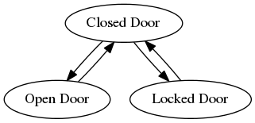

# State

The intent of the [State](http://c2.com/cgi/wiki?StatePattern) design pattern is
to "allow an object to alter its behavior when its internal state changes. The
object will appear to change its class". The State pattern can be used, for
instance, to implement a [Finite State Machine](https://en.wikipedia.org/wiki/Finite-state_machine)
efficiently and elegantly. This approach can be useful when implementing
business processes or workflows.

## Example: Door

Consider a class `Door` that represents a door. A door can be in one of three
states: open, closed, locked. When a `Door` object receives messages (such as
`open()`, `close()`, `lock()`, or `unlock()`) from other objects, it responds
differently depending on its current state. For example, the effect of an
`open()` message depends on whether the door is in its closed state or not (a
locked door has to be unlocked before it can be opened, for instance). The State
pattern describes how a `Door` object can exhibit different behavior in each
state. The key idea in this pattern is to introduce classes to represent the
states of the door.

### DoorInterface

The `DoorInterface` interface declares an interface common to all classes that
represent different states.

```php
<?php
interface DoorInterface
{
    public function open();
    public function close();
    public function lock();
    public function unlock();
}
```

### AbstractDoorState

The `AbstractDoorState` class implements the operations required by the
`DoorInterface` interface in such a way that all methods raise an
`IllegalStateTransitionException` by default.

```php
<?php
abstract class AbstractDoorState implements DoorInterface
{
    public function open()
    {
        throw new IllegalStateTransitionException;
    }

    public function close()
    {
        throw new IllegalStateTransitionException;
    }

    public function lock()
    {
        throw new IllegalStateTransitionException;
    }

    public function unlock()
    {
        throw new IllegalStateTransitionException;
    }
}
```

### OpenDoorState, ClosedDoorState, and LockedDoorState

`OpenDoorState`, `ClosedDoorState`, and `LockedDoorState` are child classes of
`AbstractDoorState` that overwrite the `open()`, `close()`, `lock()`, and
`unlock()` methods appropriately to return the object that represents the new
state. `OpenDoorState::close()` returns an instance of `ClosedDoorState`, for
instance:

```php
<?php
class OpenDoorState extends AbstractDoorState
{
    public function close()
    {
        return new ClosedDoorState;
    }
}
```

### Door

The `Door` class maintains a state object (an instance of a subclass of
`AbstractDoorState`) that represents the current state of the door:

```php
<?php
class Door implements DoorInterface
{
    private $state;

    public function __construct(DoorInterface $state)
    {
        $this->setState($state);
    }

    public function open()
    {
        $this->setState($this->state->open());
    }

    public function close()
    {
        $this->setState($this->state->close());
    }

    public function lock()
    {
        $this->setState($this->state->lock());
    }

    public function unlock()
    {
        $this->setState($this->state->unlock());
    }

    private function setState(DoorInterface $state)
    {
        $this->state = $state;
    }
}
```

The `Door` class forwards all state-specific messages to this state object.
Whenever the door changes state, the `Door` object changes the state object it
uses.

### Usage Example

```php
<?php
require __DIR__ . '/src/autoload.php';

$door = new Door(new OpenDoorState);
var_dump($door->isOpen());

$door->close();
var_dump($door->isClosed());

$door->lock();
var_dump($door->isLocked());

$door->lock();
```

The example script above yields the output below:

    bool(true)
    bool(true)
    bool(true)

    Fatal error: Uncaught exception 'IllegalStateTransitionException' in AbstractDoorState.php:25
    Stack trace:
    #0 Door.php(35): AbstractDoorState->lock()
    #1 example.php(13): Door->lock()
    #2 {main}
      thrown in AbstractDoorState.php on line 25

## Generating the State Machine

The `generate.php` script can generate the code shown above from an XML
specification such as the one shown below:

```xml
<?xml version="1.0" encoding="UTF-8"?>
<specification>
 <states>
  <state name="OpenDoorState" query="isOpen"/>
  <state name="ClosedDoorState" query="isClosed"/>
  <state name="LockedDoorState" query="isLocked"/>
 </states>
 <transitions>
  <transition from="ClosedDoorState" to="OpenDoorState"   operation="open"/>
  <transition from="OpenDoorState"   to="ClosedDoorState" operation="close"/>
  <transition from="ClosedDoorState" to="LockedDoorState" operation="lock"/>
  <transition from="LockedDoorState" to="ClosedDoorState" operation="unlock"/>
 </transitions>
</specification>
```

## Visualizing the State Machine

Using static code analysis we can automatically find all child classes of the
`AbstractDoorState` class. By looking at the `@return` annotations of `open()`,
`close()`, `lock()`, and `unlock()` methods of these classes we can figure the
transitions that are allowed from the state represented by these classes.

The `visualize.php` script implements this approach to generate a representation
of the state machine as a directed graph in [Dot](http://graphviz.org) markup.



## Documenting the State Machine through Tests

Using PHPUnit's [TestDox](http://phpunit.de/manual/current/en/other-uses-for-tests.html#other-uses-for-tests.agile-documentation)
functionality we can automatically generate documentation for the state
machine based on its tests:

    OpenDoor
     [x] Can be closed
     [x] Cannot be opened
     [x] Cannot be locked
     [x] Cannot be unlocked

    ClosedDoor
     [x] Cannot be closed
     [x] Can be opened
     [x] Can be locked
     [x] Cannot be unlocked

    LockedDoor
     [x] Cannot be closed
     [x] Cannot be opened
     [x] Cannot be locked
     [x] Can be unlocked

This automatically generated checklist makes it clear which transitions are
allowed between the three states of the state machine.
